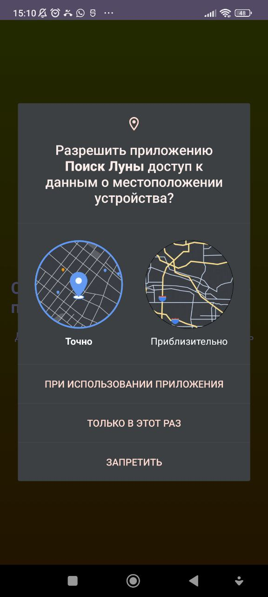
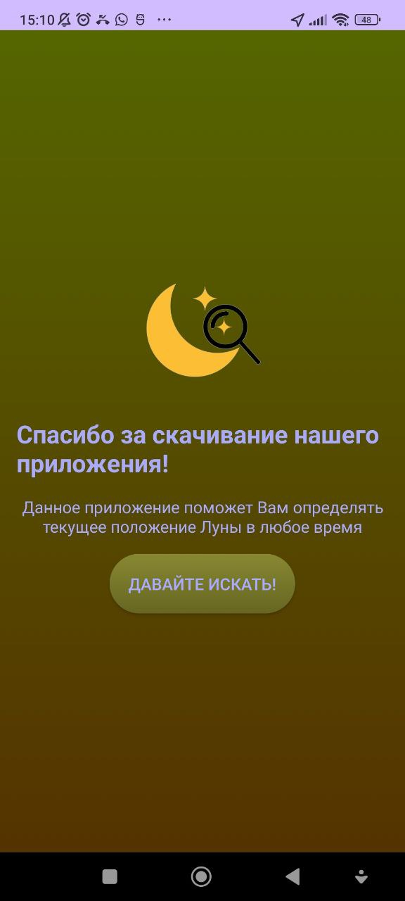
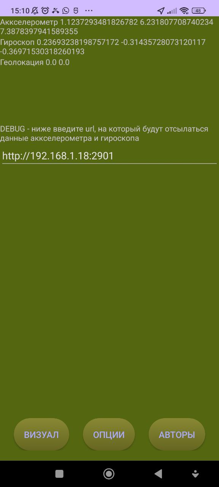
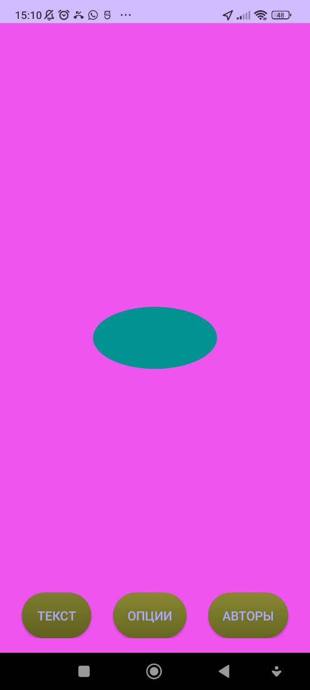
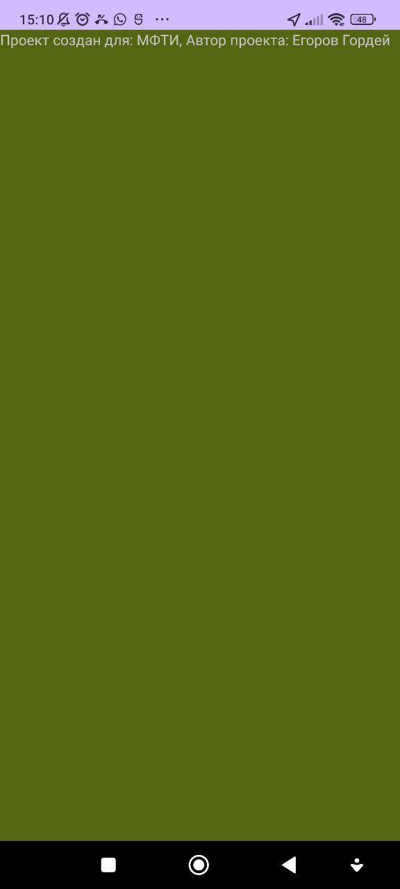
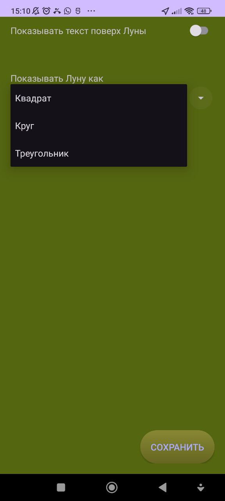

# Project info

## Description

Have you ever wanted to know where the moon currently is, but sky is too cloudy or you are too lazy to look for it yourself?

This project aims to help you locate the Moon by using your phone

## How to use

1) Launch the app and allow it to access GPS
2) Move your phone around
3) The moon icon will appear on your screen, so you can follow it and find the real Moon position!

# Dev

## Structure

- MainActivity.kt - main activity

- IntentProcessor.kt - allows deeplink processing

- DebugSendData.kt - is needed for debug only, I will delete it at some point

- fragment/ - folder with different fragments for showing UI

- position/ - singletones for 1) determining GPS location, 2) acquiing accelerometer/gyroscope data for device position, 3) requesting Moon position from website

### fragments

The order of showing fragments:

<pre>
                            GreetingsFragment.kt
                                      |
      MainFragment.kt (inside: TextViewFragment.kt or VisualViewFragment.kt)
         /                                                              \
SettingsFragment.kt                                             CredentialsFragment.kt
</pre>

- GreetingsFragment.kt - simple greeting screen, is shown only once

- MainFragment.kt - container for either TextViewFragment.kt or VisualViewFragment.kt. Responsible for displaying GPS/gyro/etc - either in text format or as image

- SettingsFragment.kt - allows customization of app

- CredentialsFragment.kt - credentials

## Screenshots

For now it only displays GPS and device data. Real moon positioning and settings are not implemented yet.

